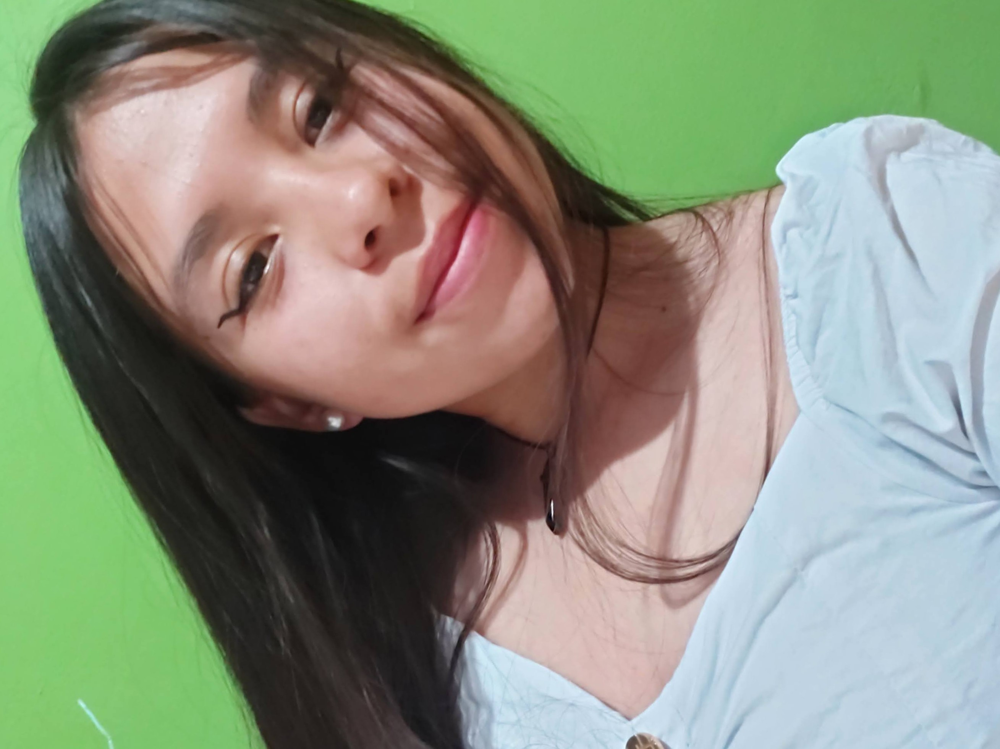

# ProgramacionVideojuegos

## Leidy Buitrago 

**Rol en la industria:** Estudiante de ingeneria multimedia. 
**Ubicación:** Boyacá, Colombia 
**Perfil:** Soy una estudiante interesada en el desarrollo de videojuegos con un enfoque en el rol de artista 3D. Me apasiona crear entornos y modelos 3D, además busco adquirir habilidades en VFX para complementar mis conocimientos en 3D y aportar a proyectos creativos y memorables.

