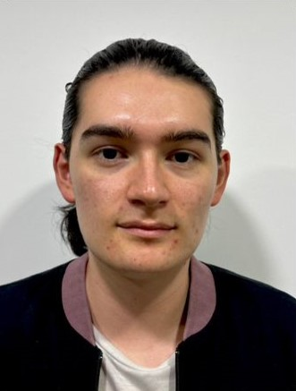
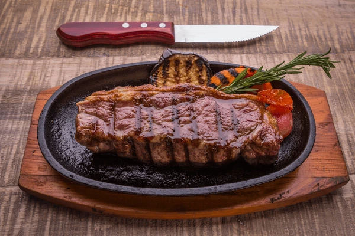

# ProgramacionVideojuegos

## Mi Presentación

### <Yeison sandoval>
**Rol en la industria**: <QA / UX>  
**Ubicación**: <Tunja,Boyaca,colombia>  

**Foto personal**  

**Mi plato favorito**  

**Perfil breve**  
<He elegido la rama de profundización en Gestión de Proyectos Multimedia porque me interesa adquirir las competencias necesarias para planificar, coordinar y supervisar cada etapa del desarrollo de videojuegos. Mi objetivo es fortalecer mis habilidades en liderazgo, control de recursos y aplicación de metodologías ágiles, con el fin de garantizar que los proyectos se desarrollen de manera eficiente y con altos estándares de calidad. Aspiro a consolidar mi perfil profesional para, en el futuro, dirigir la producción integral de videojuegos que combinen innovación, creatividad y un sólido enfoque técnico.>

---